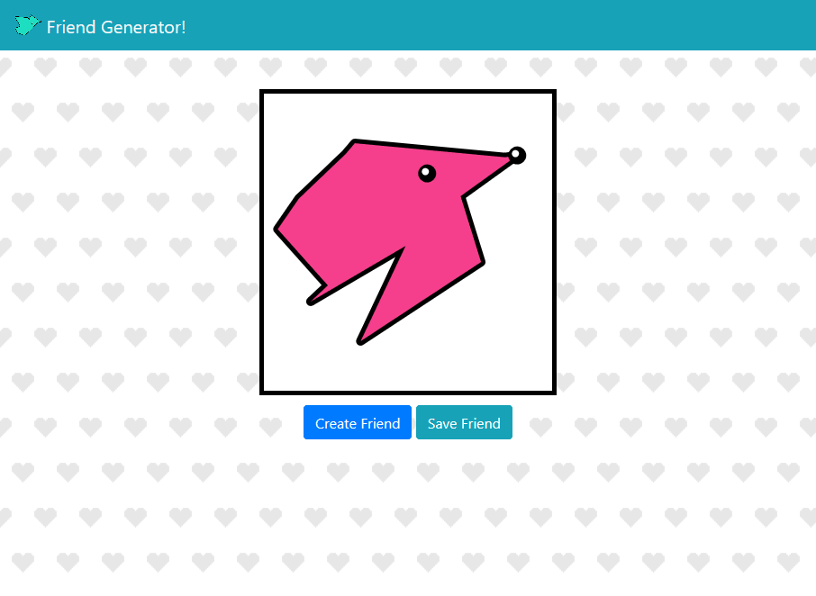

# Friend Generator

## What is this?
Friend Generator makes you new friends at the click of a button! And you can always have them by your side with the click of another button.

[Check it out!](http://slaton.info/projects/friend-gen/index.html)

## Why?

I like to doodle a lot, and I often find myself drawing squiggles and putting eyes/faces on them. This is my attempt at automating that. They're cute, they have no other justification!

## How?

Friend Generator creates random polygons.

It then positions the right eye at the rightmost vertex of the polygon, and the left eye slightly to the left and below. If that eye position isn't inside the polygon, it tries again until a valid position is found.

That's it! Deceptively simple.

### Resoureces

This project is possible thanks to the following resources:

* [Stev's method for generating random polygons](https://observablehq.com/@tarte0/generate-random-simple-polygon)
* [Dan Fox's line segment intersection function](https://stackoverflow.com/questions/9043805/test-if-two-lines-intersect-javascript-function)
* [Bootstrap](https://getbootstrap.com/)
* [andreabreu's super-small color generator](https://gist.github.com/mucar/3898821#gistcomment-3011061)
* [Wikipedia on 'Point in Polygon'](https://en.wikipedia.org/wiki/Point_in_polygon)
* [Subtle Patterns](https://www.toptal.com/designers/subtlepatterns/)
